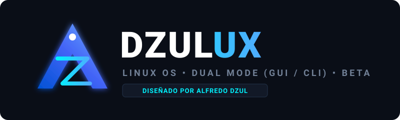

# ⚡ Dzulux Linux (Beta)

> **Un sistema operativo equilibrado, ágil y universal con arranque Dual (Gráfico / Terminal)**  
> **Creado y Diseñado por: Alfredo Dzul**

---

<p align="center">
  
</p>

<p align="center">
  
  
  
  
  
</p>

<p align="center">
  <a href="https://github.com/Alfredo2364/Linux/releases/download/v1.1-beta/Dzulux-Linux-1.1-Beta-Paquete-Completo.zip">
    
  </a>
</p>

<p align="center">
  <a href="https://github.com/Alfredo2364/Linux/releases/download/v1.1-beta/dzulux-1.1-beta-x86_64.iso">💿 Descargar solo archivo .ISO</a> &nbsp;•&nbsp; 
  <a href="https://github.com/Alfredo2364/Linux/releases/download/v1.1-beta/Guia_y_Agradecimientos_Dzulux.pdf">📄 Descargar Guía y Agradecimientos (PDF)</a> &nbsp;•&nbsp;
  <a href="https://alfredo2364.github.io/Linux/">🌐 Ver Sitio Web Oficial</a>
</p>

---

## ⚠️ Aviso Importante: Versión en Estado BETA

> [!WARNING]
> **Dzulux Linux se encuentra actualmente en fase BETA activa.**  
> Esto significa que el sistema está completamente estructurado y listo para pruebas, pero **puede contener fallos menores, detalles de compatibilidad o aspectos por pulir** en determinados modelos de hardware.  
> Se recomienda realizar pruebas iniciales en máquinas virtuales (VirtualBox, VMware, QEMU) o en particiones secundarias dedicadas a pruebas. Si encuentras algún error o tienes sugerencias de mejora, puedes reportarlo en la sección de [Issues de GitHub](https://github.com/Alfredo2364/Linux/issues).

---

## 🌟 Filosofía y Características de Dzulux

**Dzulux** nace con el objetivo de ofrecer una distribución Linux que logre el **equilibrio perfecto**:
- **No es un sistema sobrecargado ni pesado** (como ciertas versiones masivas de Ubuntu que consumen más de 2 GB de RAM en reposo).
- **Tampoco es un sistema esquelético ni difícil de instalar**, ofreciendo comodidad visual, controladores completos y herramientas accesibles para cualquier persona.

### 1. 🔄 Concepto Dual Integrado (Gráfico vs. Terminal)
Tú decides cómo interactuar con tu equipo en cualquier momento:
* **Modo Gráfico (Desktop GUI)**: Entorno visual moderno basado en **XFCE personalizado** con tema oscuro elegante (*Arc-Dark*), iconos estilizados (*Papirus*), tipografía limpia (*Inter*) y fondos de pantalla oficiales de Dzulux. Consumo medio de solo **~550 MB de RAM**.
* **Modo Terminal (Inspirado en la estabilidad de Ubuntu Server)**: Arranque directo en línea de comandos de alto rendimiento. Diseñado con las mismas comodidades y herramientas de administración que hacen popular a Ubuntu Server:
  * **Acceso Remoto**: Servidor **OpenSSH** (`sshd`) preconfigurado para conectarte desde otras PCs.
  * **Seguridad Sencilla**: Cortafuegos **UFW** (el mismo de Ubuntu: `sudo ufw allow 22`, `sudo ufw enable`).
  * **Gestión de Red Simplificada (`nmtui`)**: Olvídate de los complejos archivos YAML de netplan; con solo teclear `nmtui` accedes a un menú interactivo a color para conectarte a Wi-Fi o configurar IPs fijas.
  * **Monitoreo y Diagnóstico**: `fastfetch` para resumen del sistema, `btop` y `htop` para monitoreo visual en terminal, y `tmux` para mantener sesiones activas.
  * **Ultra Ligero**: Consume apenas **~120 - 180 MB de RAM** (frente a los ~400 MB de Ubuntu Server) y libre de servicios pesados o snaps forzados.
* **Alternancia en caliente**: Con el comando exclusivo `switch-mode` puedes pasar de terminal a escritorio (o viceversa) sin reiniciar.

### 2. 🎮 Compatibilidad Universal de Hardware
* **Tarjetas Gráficas (GPU)**:
  * **Intel**: Soporte completo con controladores Mesa, Vulkan y aceleración por hardware (`intel-media-driver`).
  * **AMD Radeon**: Controladores libres `amdgpu` y aceleración `vulkan-radeon`.
  * **NVIDIA**: Soporte para controladores propietarios dinámicos (`nvidia-dkms`), utilidades y gestión de tarjetas híbridas en laptops con `nvidia-prime`.
* **Equipos Apple Mac (Intel x86_64)**:
  * Controladores Wi-Fi para chips Broadcom (`broadcom-wl`).
  * Configuración del teclado Apple (`hid_apple`) con teclas multimedia/brillo nativas y distribución adaptada.
* **Portátiles y Laptops**:
  * Gestión inteligente de batería mediante **TLP** y `upower` para maximizar la autonomía.
  * Control universal de brillo de pantalla mediante teclas Fn con `brightnessctl`.
  * Gestión térmica para procesadores portátiles con `thermald`.
* **Sonido de Nueva Generación**:
  * Pila de audio moderna **PipeWire** con **WirePlumber**.
  * Paquete de firmware **SOF** (`sof-firmware`) y `alsa-ucm-conf`, indispensables para reconocer bocinas y micrófonos internos en laptops modernas.

### 3. 🪟 Soporte Dual Boot (Conservar Windows / macOS)
Dzulux está preparado para convivir en paz con el sistema que trajo tu equipo:
* **En el instalador (`dzulux-installer`)**: Te da a elegir entre una instalación limpia o el modo **Dual Boot**. En modo Dual Boot, tu sistema operativo original (Windows 10/11, macOS u otra distribución) **no se borra**, sino que Dzulux se instala en una partición dedicada compartiendo la partición EFI.
* **Detección automática con `os-prober`**: El cargador de arranque GRUB escanea automáticamente todas las particiones del equipo para localizar **Windows Boot Manager** o sistemas Mac.
* **Menú de selección al encender la PC**: Cada vez que prendas tu equipo podrás elegir fácilmente si arrancar en:
  1. `Dzulux Linux (Modo Gráfico / Desktop)`
  2. `Dzulux Linux (Modo Terminal / Servidor CLI)`
  3. `Windows Boot Manager (o el sistema que trajo tu equipo)`
* **En el menú de la memoria USB Live**: Incluso antes de instalar nada, la USB te ofrece la opción directa de arrancar el Windows o sistema existente en tu disco duro si necesitas acceder a él sin retirar la memoria.

### 4. 🚀 Salvavidas para Laptops de Gama Baja y Memoria Soldada de 32 GB (eMMC)
* **Detección Automática de Hardware Modesto**: El instalador evalúa el procesador (Intel Celeron, Pentium, Atom, AMD Athlon básico de 2 núcleos) y restringe opciones pesadas para instalar de forma segura **Dzulux Lite** (~380 MB de RAM en reposo, compositor de sombras desactivado y respuesta instantánea a 60 FPS).
* **Compresión Btrfs Transparente (zstd:1)**: En equipos con discos soldados de 32 GB (HP Stream, Lenovo IdeaPad 1, Cloudbooks), donde Windows se satura por falta de espacio, Dzulux comprime el sistema reduciendo su huella a solo **~3.5 GB**, dejando más de **26 GB libres** para tus documentos.
* **zRAM Integrado**: Duplica la memoria útil comprimiendo páginas inactivas directamente en RAM para eliminar los congelamientos en laptops con 2 GB o 4 GB.
* **Protección de Vida Útil de Memoria Flash**: Montaje con opción `noatime` y servicio `paccache.timer` para auto-limpiar paquetes obsoletos y evitar el desgaste prematuro de chips eMMC.

---

## 🛠️ La Suite Exclusiva de Herramientas Dzulux

Dzulux Linux incorpora una suite de utilidades interactivas nativas (disponibles en terminal y con lanzador oficial en el menú de aplicaciones de XFCE):

| Herramienta | Comando | Lanzador | Descripción |
| :--- | :--- | :---: | :--- |
| **Instalador Guiado** | `dzulux-installer` | 📋 | Asistente paso a paso con soporte Dual Boot real, detección de eMMC y selector automático de **Dzulux Lite** para Celeron/Athlon. |
| **Motor de Rendimiento** | `dzulux-performance` | ⚡ | Audita tu CPU y ofrece perfiles: *Oficina Inteligente* (cero lag y silencioso), *Game Booster* puro y *Gamer Sin Límites* (con OBS/Discord blindados y congelador de apps). |
| **Descarga de Drivers** | `dzulux-drivers` | 🎮 | Escanea tu hardware real (GPU NVIDIA/AMD/Intel, Wi-Fi Broadcom/Realtek, audio SOF, batería) y descarga los controladores oficiales en 1 clic sin engordar la ISO. |
| **Tienda de Software** | `dzulux-apps` | 🛍️ | Centro de instalación rápida en 1 clic para Steam, Discord, VS Code, LibreOffice, Obsidian, Chrome y Brave con Flathub preconfigurado. |
| **Puntos de Restauración** | `dzulux-snapshots` | 🛡️ | Crea capturas instantáneas del sistema en 1 segundo con Btrfs (0 MB de espacio) con reversión desde el menú de arranque GRUB. |
| **Rescate de Windows** | `dzulux-rescue` | 🚑 | Elimina contraseñas olvidadas de Windows en 10 segundos con `chntpw`, rescata archivos de discos dañados y audita la salud S.M.A.R.T. del disco. |
| **Gestor de Batería** | `dzulux-battery` | 🔋 | Ahorro de energía para laptops con Wi-Fi configurable (Modo Productivo mantiene internet activo para entregar tareas, y Modo Emergencia Extrema). |
| **Modo Privacidad** | `dzulux-stealth` | 🕵️ | Protección en redes Wi-Fi públicas: asigna una dirección MAC aleatoria, activa DNS seguro anti-malware (Quad9/Cloudflare) y activa firewall estricto. |
| **Gestor de Estilos** | `dzulux-looks` | 🎨 | Cambia entre tema Cyberpunk Dark, **Estilo Windows 10** (con barra inferior y Menú de Inicio con buscador y categorías) o Modo Minimal Flat. |
| **Actualizador Oficial** | `dzulux-update` | 🔄 | Descarga directamente los últimos scripts, parches y herramientas oficiales de Dzulux desde GitHub sin reinstalar el sistema. |
| **Alternador de Modo** | `switch-mode` | 🔄 | Cambia en vivo entre escritorio gráfico y modo terminal (`switch-mode gui`, `switch-mode cli`, `switch-mode lowspec on/off`). |
| **Diagnóstico de Hardware** | `hw-detect` | 🖥️ | Escanea y reporta el estado de tu GPU (Intel/AMD/NVIDIA), batería de laptop, servidor de audio y compatibilidad Mac. |
| **Información del Sistema** | `fastfetch` | ⚡ | Muestra los datos de hardware del equipo acompañados del logo oficial y la firma de **Alfredo Dzul**. |
| **Pantalla de Bienvenida** | `dzulux-welcome` | 🚀 | Guía rápida que se despliega al abrir la terminal para orientarte en tus primeros pasos. |

---

## 🔥 Novedades y Parches de la Versión 1.1 (Beta)

* **Actualizador del Sistema en Vivo (`dzulux-update`)**: Permite que cuando subas actualizaciones o mejoras al repositorio de GitHub, cualquier usuario ejecute este comando y descargue directamente la última versión de scripts, temas y parches sin reinstalar el sistema operativo.
* **Asistente Inteligente de Controladores (`dzulux-drivers`)**: Descarga dinámica al vuelo según el hardware específico, logrando que la imagen ISO se mantenga en **1.69 GB** (muy por debajo del límite de 2 GiB de GitHub Releases).
* **Edición "Dzulux Lite" con Detección de CPU**: Si el instalador detecta procesadores Intel Celeron, Pentium, Atom o AMD Athlon (<= 2 núcleos), limita las opciones a la versión Lite con optimizaciones para erradicar congelamientos.
* **Menú de Inicio estilo Windows 10 en `dzulux-looks`**: Integración de Whisker Menu en la barra inferior con buscador instantáneo, cuadrícula de aplicaciones categorizadas y tecla `Super` vinculada.
* **Dzulux Performance Engine (`dzulux-performance`)**: Auditoría de CPU por gama, perfil de oficina silencioso y modo streaming blindado para OBS Studio y Discord con congelador de procesos secundarios (`SIGSTOP`/`SIGCONT`).
* **Suite de Emergencia y Rescate (`dzulux-rescue`)**: Quitado de contraseñas de Windows en 10 segundos y auditoría de salud de disco S.M.A.R.T.
* **Tienda Curada (`dzulux-apps`)**: Acceso inmediato a aplicaciones populares con repositorio oficial y Flatpak.
* **Escudo Wi-Fi Público (`dzulux-stealth`)**: Anonimato con MAC cambiante y DNS cifrado anti-rastreo.
* **Gestor de Batería con Wi-Fi (`dzulux-battery`)**: Resuelve la necesidad de ahorrar energía sin quedarse sin internet para enviar trabajos escolares o laborales.
* **Soporte Avanzado para Memorias Soldadas de 32 GB (eMMC)**: Particionado con Btrfs zstd:1, reduciendo la instalación a solo ~3.5 GB y dejando más de 26 GB libres.

---

## 📦 Estructura del Repositorio

```text
Linux Propio/
├── .github/workflows/
│   └── build-iso.yml          # Flujo de CI/CD para compilar la ISO en GitHub Actions
├── artwork/                   # Logotipos y fondos de pantalla vectoriales SVG
│   ├── dzulux-logo.svg
│   └── dzulux-wallpaper.svg
├── iso-profile/               # Perfil maestro de archiso
│   ├── profiledef.sh          # Definición de la ISO, versión y permisos
│   ├── packages.x86_64        # Lista exhaustiva de paquetes y controladores
│   ├── pacman.conf            # Configuración de repositorios oficiales
│   ├── grub/                  # Menú de arranque UEFI con opciones Dual Mode
│   ├── syslinux/              # Menú de arranque BIOS Legacy
│   └── airootfs/              # Sistema de archivos superpuesto
│       ├── etc/               # os-release, banners, configs de XFCE, LightDM y Mac
│       ├── usr/local/bin/     # Scripts: installer, hw-detect, switch-mode
│       └── usr/share/         # Fondos de pantalla y Fastfetch
├── scripts/
│   ├── build.sh               # Script de compilación local en Linux o WSL2
│   └── test-qemu.bat          # Script para probar la ISO en Windows con QEMU
└── README.md                  # Documentación del proyecto
```

---

## 🚀 ¿Cómo Compilar la ISO de Dzulux?

Tienes dos formas de generar el archivo `.iso` de instalación:

### Método A: Compilación Automática en la Nube (Recomendado si usas Windows)
No necesitas instalar Linux ni configurar herramientas complejas en tu equipo:
1. Sube tus cambios o haz un push a este repositorio en GitHub:
   ```bash
   git add .
   git commit -m "Compilar Dzulux Beta"
   git push origin main
   ```
2. Ve a la pestaña **Actions** en tu repositorio de GitHub.
3. El flujo de trabajo `Compilar ISO y Paquete de Dzulux Linux` se iniciará automáticamente.
4. Al finalizar la compilación, encontrarás en la sección de **Artifacts** o **Releases** el paquete comprimido:
   * 📦 **`Dzulux-Linux-1.1-Beta-Paquete-Completo.zip`**, que incluye:
     * 💿 La imagen del sistema: **`dzulux-1.1-beta-x86_64.iso`**
     * 📄 La **`Guía y Agradecimientos en PDF`** escrita y firmada por **Alfredo Dzul** con instrucciones de booteo y primeros pasos.
     * 🔒 El archivo de sumas de comprobación **`sha256sum.txt`**.

### Método B: Compilación Local (En Arch Linux o WSL2)
Si cuentas con una máquina con Arch Linux o WSL2 con soporte de contenedores/archiso:
1. Clona el repositorio e ingresa en él:
   ```bash
   git clone https://github.com/Alfredo2364/Linux.git
   cd Linux
   ```
2. Ejecuta el script de compilación con privilegios de superusuario:
   ```bash
   sudo ./scripts/build.sh
   ```
3. La ISO compilada se generará en la carpeta `output/`.

---

## 💻 ¿Cómo Probar la ISO?

### 1. En Windows con QEMU
Si tienes QEMU instalado en Windows, simplemente haz doble clic en:
```cmd
scripts\test-qemu.bat
```
O arrastra la ISO descargada sobre el archivo `.bat`.

### 2. En Máquinas Virtuales (VirtualBox / VMware)
* **Tipo**: Linux
* **Versión**: Arch Linux (64-bit)
* **Memoria RAM**: 2 GB mínimo (4 GB recomendado)
* **Arranque**: Habilitar soporte EFI en la configuración de la máquina virtual.

### 3. En Hardware Real (PC, Laptop o Apple Mac)
Graba la imagen `.iso` en una memoria USB usando cualquiera de las siguientes herramientas:
* [Ventoy](https://www.ventoy.net/) (Recomendado: solo copia el `.iso` dentro de la USB)
* [Rufus](https://rufus.ie/) (Seleccionar modo DD o ISO)
* [BalenaEtcher](https://etcher.balena.io/)

Conecta la USB al equipo, enciéndelo presionando la tecla de arranque (`F12`, `F11`, `F8` en PC, o manteniendo pulsada la tecla `Option / Alt` en Mac) y selecciona **Dzulux Linux**.

---

## ✒️ Créditos y Autoría

* **Diseño, Arquitectura e Identidad**: Alfredo Dzul
* **Base de Distribución**: Arch Linux Project
* **Repositorio Oficial**: [https://github.com/Alfredo2364/Linux](https://github.com/Alfredo2364/Linux)

---

<p align="center">
  <i>Dzulux Linux 1.1 (Beta) — Hecho con pasión por el software libre y el control total de tu equipo.</i>
</p>
